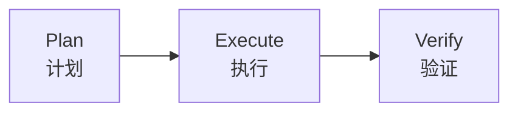
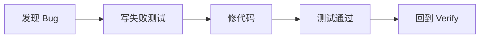
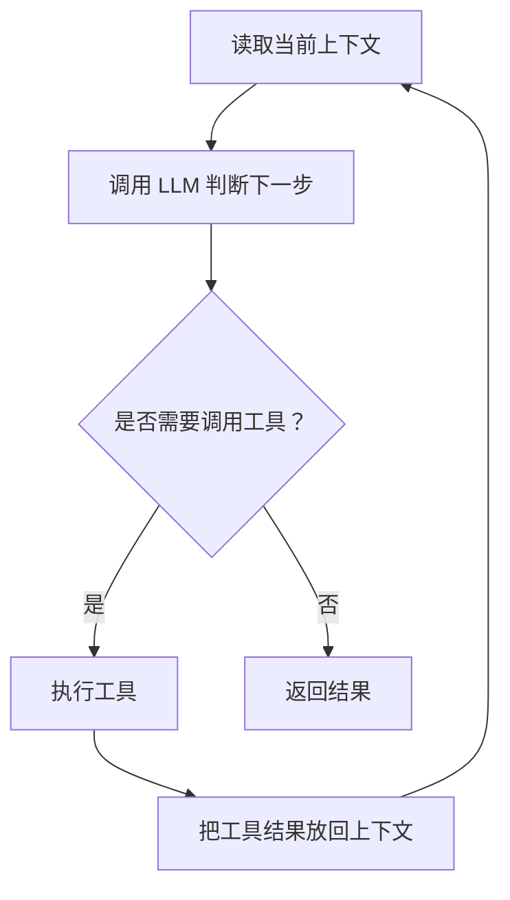
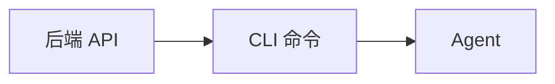

# AI 前端分享 PPT 纯文案版

> 基于 [ai-frontend-sharing-v3-ppt-copy.md](</D:/work/ai-share/ai-frontend-sharing-v3-ppt-copy.md>) 整理  
> 只保留每页 PPT 的上屏文案内容

---

## 第 1 页：封面

`AI 是如何在前端开发流程中应用的`

`从个人工作流，到 Agent 原理，再到团队实践`

`分享人：XXX`

`面向：产品 / 前端 / 后端 / 测试 / 设计 / 技术负责人`

---

## 第 2 页：全篇主线

`这场分享的主线`

`AI 不是替你做判断，而是把执行这件事放大了。`

- 工作流
- Agent 原理
- 学习方法
- 团队实践

`从怎么用，到为什么能这样用，再到团队怎么放大价值。`

---

## 第 3 页：AI 常见翻车模式

`为什么不能一上来就让 AI 直接写？`

- 自信地写错
- 重复造轮子
- 漏看上下文
- 能跑，但难维护

`很多时候，问题不是 AI 完全不会做，而是它很容易做得“像对的一样”。`

`所以我们需要一套流程，不是为了拖慢 AI，而是为了把风险控制住。`

---

## 第 4 页：PEV 工作流

`PEV 工作流`



`先想清楚，再让它做，最后认真验。`

`人做决策，AI 做执行。`

---

## 第 5 页：PLAN：先出计划，不先写代码

`PLAN：先出计划，不先写代码`

`先给 Agent 三样东西`

- 需求描述
- PRD 原文
- 约束条件

`Agent 输出实现计划`

- 任务拆解
- 关键文件
- 架构权衡
- 实施步骤

`先看清方向，再让 AI 动手。`

---

## 第 6 页：确认方案后，再放行执行

`确认方案后，再放行执行`

`先审查计划`

- 步骤是否合理
- 场景是否遗漏
- 范围是否清楚

`再给反馈（如果需要）`

- 提出疑问
- 调整方案
- 补充需求

`最后放行执行`

- AI 开始写代码
- 按规则执行
- 写完补测试并跑校验

`先把方案看对、想全、调顺，再放行执行。`

---

## 第 7 页：人做最后的质量把关

`人做最后的质量把关`

`Code Review`

- 风格和架构
- 重复逻辑
- 安全隐患
- 类型严谨性

`功能自测`

- 流程完整
- 交互流畅
- 错误提示
- 响应式布局

`AI 加快的是产出速度，人负责最后的质量把关。`

---

## 第 8 页：修 Bug 的闭环

`发现 Bug 后，不是直接修，而是先写红测`



`先复现，再修复。`

`修 Bug 不靠感觉，靠可重复验证的闭环。`

---

## 第 9 页：第二部分封页

`第二部分：AI Agent 的运行原理`

`为什么它看起来像会自己干活？`

`这一部分统一用“查天气”这个例子来讲清楚原理。`

---

## 第 10 页：Agent 是怎么一轮轮工作的？

`Agent 是怎么一轮轮工作的？`

```ts
while (!taskComplete) {
  const response = LLM(messages, tools); // 判断下一步

  if (response.toolCalls) {
    const results = executeTools(response.toolCalls); // 执行工具
    messages.push(...results); // 结果回到上下文
  } else {
    return response.content; // 输出最终答案
  }
}
```



`Agent 不是一次性把答案想完，而是带着最新上下文一轮轮继续判断和执行。`

---

## 第 11 页：messages 为什么会越来越长？

`messages 为什么会越来越长？`

`第一次传给 LLM`

```text
- system:
  你是一个 agent，需要优先使用工具获取实时信息。

- user:
  帮我查一下杭州今天的天气。
```

`LLM 返回`

```text
- tool call:
  name: "getWeather"
  arguments: { city: "杭州" }
```

`第二次传给 LLM`

```text
- system:
  你是一个 agent，需要优先使用工具获取实时信息。

- user:
  帮我查一下杭州今天的天气。

- assistant:
  调用工具 getWeather({ city: "杭州" })

- tool:
  杭州，晴，25°C，东北风 2 级。
```

`下一轮不是重新开始，而是把上一轮的 tool call 和工具结果一起带回给 LLM。`

---

## 第 12 页：tools 决定它能做什么

`LLM 为什么不只是会回答，还能调用工具？`

```ts
const tools = {
  getWeather: {
    description: "查询指定城市的实时天气",
    execute: ({ city }) => {
      return `${city}，晴，25°C，东北风 2 级`;
    }
  }
};

const call = { name: "getWeather", args: { city: "杭州" } };
const result = tools[call.name].execute(call.args);
```

`可以把 tools 理解成一张菜单。`

- `tools`：菜单上有哪些服务可以点
- `name`：点的是哪一项服务
- `args`：这次具体要什么
- `execute()`：后台真正去完成这项服务
- `result`：最后返回给模型的结果

`LLM 更像是在下单，不是在亲自做事。`

`LLM 负责决定“调用什么”，外层程序负责真正“把事情做完”。`

---

## 第 13 页：一句话理解 Agent

`一句话理解 Agent`

`Agent 不是魔法，它只是把“会回答”变成了“会行动”。`

- 每一轮都带着最新上下文重新调用 LLM
- LLM 决定是否调用工具
- 工具结果再回到上下文里进入下一轮

---

## 第 14 页：怎么持续跟进 AI 变化

`怎么持续跟进 AI 变化`

`不是追所有变化，而是建立感知，然后在需要的时候快速深入。`

- GitHub Trending 保持感知
- AI 辅助读源码
- 固定关注高质量信息源

---

## 第 15 页：从代码助手，到业务助手

`从代码助手，到业务助手`

`AI 能不能不只是代码助手，还能变成业务助手？`



`把已有系统能力，换一种更适合 Agent 调用的暴露方式。`

---

## 第 16 页：建议从低风险场景开始

`建议从低风险场景开始`

```text
“查一下今天有多少笔待审批的付款”
“把金额最大的那笔详情给我看”
“这笔交易的汇率是多少”
```

1. 先做查询类 CLI
2. 打通权限体系
3. 留好审计日志
4. 再逐步扩展复杂操作

---

## 第 17 页：结束语

`最后想留给大家的一句话`

`AI 能放大你的能力，但不能替代你的判断。`

- 工具会越来越强
- 速度会越来越快
- 结果质量仍然取决于人的判断、规则和把关

---

## 第 18 页：Q&A

`Q&A`

