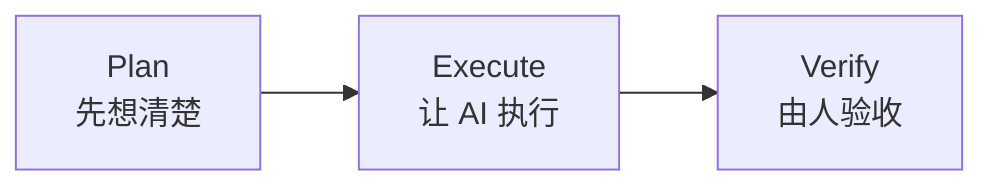
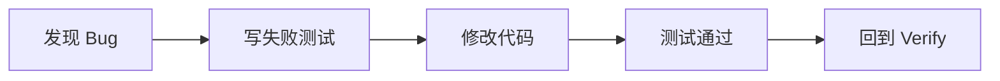
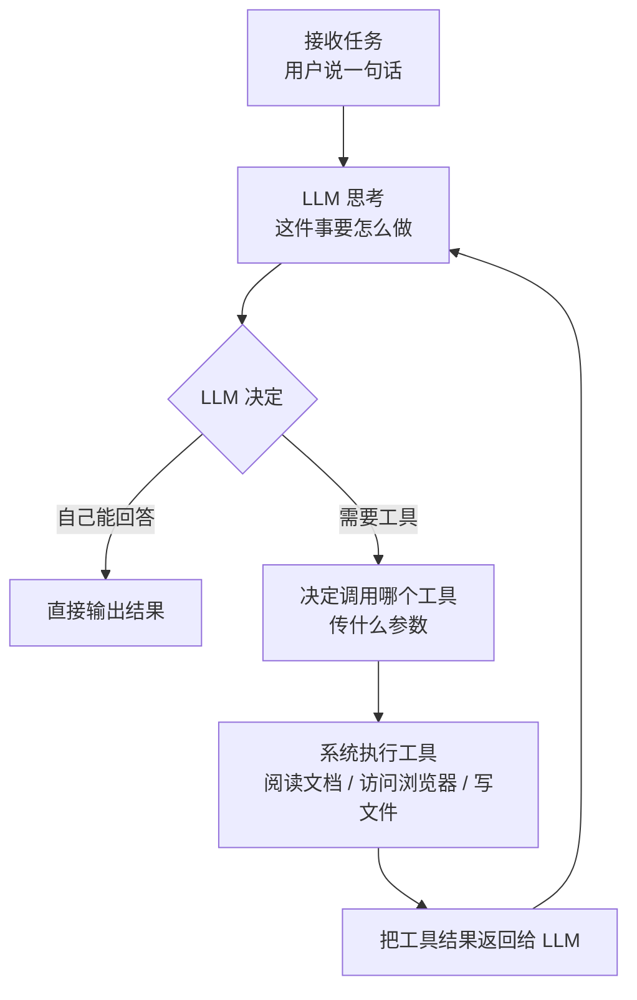

# AI 前端分享 PPT 文案方案（优化版）

> 基于 [ai-frontend-sharing-v3.md](/D:/work/ai-share/ai-frontend-sharing-v3.md) 整理\
> 目标：这不是逐字演讲稿，而是一份适合直接做 PPT 的文案方案。每一页都尽量做到“标题清楚、上屏克制、口播有空间”。

***

## 使用原则

- 一页只讲一个重点，不要让一页承担两个结论。
- 屏幕上放结论和结构，解释留给口播。
- 每页尽量控制在 `40-60` 字以内，代码页和流程页除外。
- 能用图，就不用长段落；能用一句话，就不用四句解释。
- 整套分享的语气要像“复盘一套可复制的方法”，不要像“介绍一个很厉害的新玩具”。

***

## 整体结构

- 页数建议：`18 页`
- 时长建议：`30-40 分钟`
- 主线顺序：
  1. 先讲为什么不能直接让 AI 开写
  2. 再讲我现在怎么用 AI
  3. 再解释 Agent 为什么看起来会自己干活
  4. 最后把视角拉到团队和业务层面

***

## 第 1 页：封面

**这一页要讲什么**

明确主题：这不是泛泛聊 AI，而是聊 AI 怎么进入真实开发流程。

**标题**

`AI 是如何在前端开发流程中应用的`

**页脚信息**

- 分享人：XXX
- 时间：2026/05/12

**布局建议**

- 大标题居中
- 页脚保留分享人
- 背景可用浅色网格、流程线或终端感元素

***

## 第 2 页：目录页

**这一页要讲什么**

快速告诉听众这场分享会讲哪四部分，让他们先建立整体结构。

**标题**

`今天主要讲四部分`

**上屏内容**

1. 我的工作流
2. Agent 原理
3. 学习方法
4. 团队实践

**布局建议**

- 页面中间直接放 4 个章节卡片
- 不需要额外大段文案
- 可以用编号、图标或横向流程把 4 部分串起来

***

## 第 3 页：为什么不能让 AI 一上来就写代码

**这一页要讲什么**

先把真实痛点讲透，观众才会理解后面为什么需要流程，而不是直接让 AI 开写。

**标题**

`为什么不能让 AI 一上来就写代码？`

**上屏文案**

1. 一上来就写，代码结构很快失控
2. 需要反复纠偏，返工成本高
3. 功能能跑，但代码质量差
4. 最后还得人工重构，维护成本高

**结论句**

`最大的问题不是写不出来，而是写出来以后越来越难收拾。`

**布局建议**

- `2 x 2` 卡片布局
- 底部放一句总结

***

## 第 4 页：我的核心方法是 PEV

**这一页要讲什么**

把后面的内容先压缩成一个简单框架，让听众有地图感。

**标题**

`我现在常用的一套 AI 工作流：PEV`

**主视觉**



**上屏文案**

`先想清楚，再让它做，最后认真验。`

`人做决策，AI 做执行。`

**布局建议**

- 中间放大流程
- 下方只放两句总结

***

## 第 5 页：PLAN：先想清楚，再动手写代码

**这一页要讲什么**

强调 Plan 阶段的核心任务是“对齐理解”，不是“赶紧开工”。

**标题**

`PLAN：先想清楚，再动手写代码`

**上屏文案**

**我会先给 AI 这三样东西**

- 需求描述
- PRD 原文
- 约束条件

**AI 输出计划文档**

- 任务拆解
- 影响范围
- 关键文件
- 验收标准
- 风险判断

**页脚总结**

`先让 AI 想方案，不要先让 AI 动手。`

**布局建议**

- 左右双栏
- 左边“输入”，右边“输出”

***

## 第 6 页：方案先过人，再进入执行

**这一页要讲什么**

把“人负责判断”这件事讲具体。

**标题**

`方案先过人，再放行执行`

**上屏文案**

**先看三件事**

- 步骤对不对
- 范围全不全
- 风险大不大

**再做三件事**

- 提疑问
- 调方案
- 补边界

**最后才执行**

- 开始实现
- 补测试
- 跑校验

**页脚总结**

`不是 AI 想完就做，而是人看完再做。`

**布局建议**

- 从上到下三层结构
- 做成“审查 -> 调整 -> 放行”的流程感

***

## 第 7 页：真正决定质量的，是 Verify

**这一页要讲什么**

把“最后一关为什么还得靠人”说透。

**标题**

`VERIFY：真正决定质量的地方`

**上屏文案**

**Code Review 看什么**

- 风格和架构
- 重复逻辑
- 安全问题
- 类型严谨性

**功能自测看什么**

- 流程完整
- 交互顺畅
- 错误提示
- 响应式表现

**页脚总结**

`AI 提高的是产出速度，人守住的是交付质量。`

**布局建议**

- 左右双栏
- 左边 Review，右边 自测

***

## 第 8 页：修 Bug 也要有闭环

**这一页要讲什么**

强调不要“感觉修好了”，而要“验证修好了”。

**标题**

`发现 Bug 后，先写红测，再修复`

**主视觉**



**上屏文案**

- 先复现，再修复
- 修 Bug 不靠感觉，靠可重复验证的闭环

**布局建议**

- 中间流程图
- 下方两条短句

***

## 第 9 页：AI Agent 实现原理

**这一页要讲什么**

先回答一个大家最关心的问题：为什么 AI 不只是会聊天，还能帮你写代码、找资料、一步步把事情做下去。

**标题**

`AI Agent 实现原理`

**上屏文案**

`为什么 AI 能帮你干活？`

`LLM（大模型） + TOOLS（工具） + LOOP（循环执行） = AI Agent`

**页脚总结**

`它看起来像在“自己干活”，本质上是因为它会结合上下文反复判断，并在需要时调用工具。`

**布局建议**

- 上方放标题
- 中间放两行核心文案
- 第一行是问题，第二行是公式
- 这一页不要放代码，重点是先把直觉讲明白

***

## 第 10 页：Agent 循环

**这一页要讲什么**

先不用代码，直接把 Agent 是怎么一轮轮工作的讲清楚，让听众先建立直觉，再进入后面的伪代码和流程图。

**标题**

`Agent 循环`

**主视觉**



**页脚总结**

`Agent 的本质不是一次生成答案，而是“判断 -> 调用工具 -> 看结果 -> 再判断”的循环。`

**布局建议**

- 这一页直接用纵向流程图展示
- 重点突出 `LLM 决定` 这个判断节点
- 不要再补大段解释，保持直观

***

## 第 11 页：Agent 的执行机制

**这一页要讲什么**

先把 Agent 的大循环讲明白。

**标题**

`Agent 的执行机制`

**左侧：伪代码**

```ts
while (!taskComplete) {
  // 基于当前上下文和可用工具，判断下一步该做什么
  const response = LLM(messages, tools);

  // 如果模型认为需要调用工具
  if (response.toolCalls) {
    // 系统执行工具调用
    const results = executeTools(response.toolCalls);

    // 把工具结果放回上下文，进入下一轮判断
    messages.push(...results);
  } else {
    // 如果不需要工具，直接输出最终结果
    return response.content;
  }
}
```

**右侧：示例（查询杭州天气）**

**第 1 轮**

- 用户：帮我查一下杭州今天的天气
- LLM 判断：这是实时信息，不能直接编
- 动作：调用天气工具

**第 2 轮**

- 工具返回：杭州，晴，25°C，东北风 2 级
- LLM 判断：信息已经够了
- 动作：整理结果，准备回复

**第 3 轮**

- 输出最终答案
- 循环结束

**页脚总结**

`Agent 不是一次想完答案，而是带着最新上下文反复判断和执行。`

**布局建议**

- 左右双栏
- 左代码，右示例说明
- 右侧用“第 1 轮 / 第 2 轮 / 第 3 轮”展示，更方便非技术同学理解

***

## 第 12 页：messages 和 tools 是什么？

**这一页要讲什么**

用一个真实结构把两个核心概念讲清楚：`messages` 是模型每一轮看到的上下文，`tools` 是模型当前可以调用的工具。

**标题**

`messages 和 tools 是什么？`

**左侧：messages**

```json
[
  {
    "role": "system",
    "content": "你是个人 AI 助手，需要理解用户的问题，并结合上下文和工具能力帮助用户解决问题。"
  },
  {
    "role": "user",
    "content": "帮我查一下杭州今天的天气"
  },
  {
    "role": "assistant",
    "tool_calls": [
      {
        "id": "call_1",
        "type": "function",
        "function": {
          "name": "get_weather",
          "arguments": "{\"city\":\"杭州\"}"
        }
      }
    ]
  },
  {
    "role": "tool",
    "tool_call_id": "call_1",
    "content": "杭州，晴，25°C，东北风 2 级"
  },
  {
    "role": "assistant",
    "content": "杭州今天是晴天，25°C，东北风 2 级。"
  }
]
```

**右侧：tools**

```json
[
  {
    // 工具类型，这里表示函数调用
    "type": "function",
    "function": {
      // 工具名称，模型会用它决定调用哪个工具
      "name": "get_weather",
      // 工具作用说明
      "description": "查询指定城市的天气信息",
      // 工具参数定义
      "parameters": {
        "type": "object",
        "properties": {
          "city": {
            // 参数类型
            "type": "string",
            // 参数说明
            "description": "城市名称，例如：杭州"
          }
        },
        // 必填参数
        "required": ["city"]
      }
    }
  }
]
```

**页脚总结**

`messages 决定它“看到了什么”，tools 决定它“能做什么”。`

**布局建议**

- 左右双栏
- 左边展示 `messages`
- 右边展示 `tools`
- 页面上可以高亮几个关键字段：`role`、`tool_calls`、`name`、`parameters`

***

## 第 13 页：一句话讲明白 Agent

**这一页要讲什么**

把第二部分收束成一句大家能记住的话。

**标题**

`一句话理解 Agent`

**上屏文案**

`Agent 不是魔法，它只是把“会回答”变成了“会行动”。`

**辅助信息**

- 带着上下文反复调用模型
- 模型决定要不要用工具
- 工具结果回来后再继续下一轮

**布局建议**

- 中间大字
- 下方 3 条辅助点

***

## 第 14 页：我是怎么学习 AI 的

**这一页要讲什么**

降低听众对“必须天天追 AI 热点”的心理压力。

**标题**

`我是怎么学习 AI 的`

**上屏文案**

1. GitHub 上最火的项目是什么  
   [github.com/trending](https://github.com/trending)
2. 用 AI 帮我读源码
3. 固定关注大厂的 GitHub 账号最近开源了什么

**结论句**

`先关注新东西，再用 AI 帮我快速入门`

**布局建议**

- 上方一句结论
- 下方 3 点并列

***

## 第 15 页：从代码助手，到业务助手

**这一页要讲什么**

把第四部分的起点讲清楚：既然 AI Agent 已经能处理信息和任务，那我们是不是也可以给它一套更适合操作业务系统的方式。

**标题**

`我们能不能给 Agent 一套更好用的操作方式？`

**上屏文案**

`既然 AI Agent 已经能处理信息和任务`

`那我们公司的项目，能不能也提供一种更适合 Agent 操作的方式？`

**辅助信息**

- 这就是后面这一部分想展开的方向
- 不是重做系统，而是换一种更适合 Agent 操作的方式

**布局建议**

- 中间放两行主文案
- 下方放 1-2 条辅助说明

***

## 第 16 页：把业务操作变成 CLI 命令

**这一页要讲什么**

把第四部分的核心思路讲具体：不是重做系统，而是把已有能力换一种更适合 Agent 调用的暴露方式。

**标题**

`思路：把业务操作变成 CLI 命令`

**上屏文案**

```bash
# 查看待处理的付款单
saas payment list --status=pending
# 查看某笔付款详情
saas payment detail --id=PAY20260509001
# 查询实时汇率
saas deal quote --pair=USD/CNH
# 查看待审批列表
saas approval list --pending
# 查询余额
saas balance check --currency=USD
```

**页脚总结**

`CLI 不是重做一套系统，而是给现有系统再加一层适合 Agent 调用的壳。`

**布局建议**

- 页面中间放命令示例
- 下方只放一句解释
- 命令不需要太多，挑 4-5 个最容易看懂的例子

***

## 第 17 页：Agent 怎么接手这些业务动作？

**这一页要讲什么**

让听众直观看到：一旦业务能力变成 CLI，Agent 就能通过自然语言把它们串起来。

**标题**

`Agent 怎么接手这些业务动作？`

**上屏文案**

```text
你：查一下今天有多少笔待审批的付款
Agent：执行 saas approval list --pending
       当前有 12 笔待审批付款，其中 3 笔超过 24 小时未处理

你：把金额最大的那笔详情给我看
Agent：执行 saas payment detail --id=PAY20260509087
       金额：USD 500,000，状态：待审批

你：这笔交易的汇率是多少？
Agent：执行 saas deal quote --pair=USD/CNH
       当前 USD/CNH 汇率：7.2450
```

**页脚总结**

`自然语言 -> Agent -> CLI -> API -> 结果返回`

**布局建议**

- 用对话形式展示
- 页面右下角可以补一行调用链路

***

## 第 18 页：结束语 / Q\&A

**这一页要讲什么**

最后只留一个干净的收尾页，不再承载新信息。

**上屏文案**

`Q&A`

`谢谢`

**布局建议**

- 页面中间直接放两行字
- 第一行：`Q&A`
- 第二行：`谢谢`
