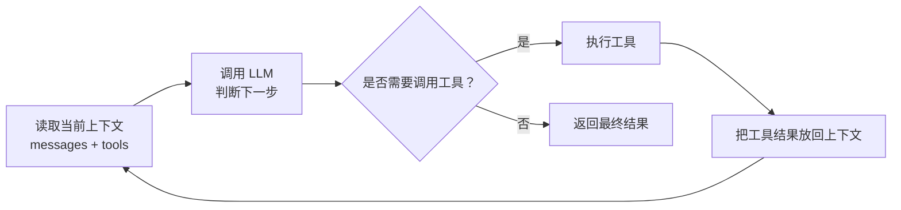

# AI 是如何在前端开发流程中应用的

## 团队内部分享演讲稿

> 分享人：XXX
> 受众：产品、后端开发、技术领导、UI 设计师、测试、前端开发

***

## 开场

大家好，今天这场分享，我不太想讲“AI 有多神奇”，我更想讲一个更落地的问题：在真实项目里，AI 到底是怎么进到开发流程里的，又是怎么帮我们把事情做得更快、更稳的。

虽然题目写的是前端，但这个话题其实不只跟前端有关。不管你是写后端、做产品、做设计还是做测试，今天的内容都和你有关系。因为 AI 改变的，不只是某一个岗位的工作方式，而是**整个团队协作的方式**。

如果把今天这场分享压缩成一句话，其实就是这句：**AI 不是替你做判断，而是把执行这件事放大了。**

所以今天我想带大家看四个部分：

1. **我的 AI 辅助开发工作流** —— 我怎么把 AI 放进日常开发
2. **AI Agent 的运行原理** —— 它为什么看起来像“会自己干活”
3. **我的 AI 学习方法** —— 这个领域变化这么快，平时怎么跟
4. **团队级延伸实践** —— 除了写代码，团队还能怎么把 AI 的价值继续放大

中间随时可以打断我提问。

***

## 第一部分：我的 AI 辅助开发工作流

### 整体框架：PEV

我现在基本把 AI 放进一个很简单的三步循环里：

```
Plan  →  Execute  →  Verify
（计划）   （执行）    （验证）
```

你可以先不用记住 `PEV` 这个缩写，先记住它的人话版本：**先想清楚，再让它做，最后认真验。**

这套东西说起来不复杂，但很实用。因为很多时候，AI 不是真的“不好用”，而是一开始就放错了位置。该让人判断的时候让 AI 判断，后面就容易越做越偏；该让 AI 去执行的时候又不敢放手，效率就起不来。

所以对我来说，`PEV` 的核心不是流程图本身，而是把分工划清楚：**人做决策，AI 做执行。**

***

### PLAN 阶段：先想清楚，再动手

`Plan` 这一段，我最在意的不是让 AI 赶紧开始写代码，而是先让它把任务边界理解对。

我通常会先给它三样东西：

1. **需求描述**：我会先自己把 PRD 看完，用自己的话再复述一遍。也就是把“要做什么、最后要达到什么效果”讲清楚。
2. **产品文档（PRD）**：完整原文我也会给它。这样做的目的很简单，就是防止我自己的总结漏掉细节。
3. **约束条件**：哪些可以做，哪些不能做，哪些地方不能改。

这里有一个我现在几乎固定会做的动作：**先不让 AI 写代码。**

我会先明确告诉它：

“先不要写代码，只输出需求分析和实现方案。”

为什么要这么做？因为如果一开始就让它直接写，它很容易在“看起来很快”的同时，把方向也一起写偏。前面省下来的几分钟，后面可能要用几个小时返工补回来。

所以我会先让它回答几个问题：

- 这次到底要实现什么功能？
- 预计要改哪些文件？
- 会影响哪些现有模块？
- 这个方案有没有明显风险？

你也可以把这一步理解成一句话：**先让 AI 想方案，不要先让 AI 动手。**

**第二步：我把方案看完，确认无误再放行**

这一步不能省。因为 AI 可能会误读 PRD，也可能会提出一个看起来挺顺、但其实不符合项目架构的方案。

所以这一步里，人的角色非常明确：不是配合它，而是给它定边界、做判断。

> 📋 **案例模板**（此处填入实际案例）：
>
> - **任务背景**：什么需求？涉及几个模块？
> - **AI 方案输出**：AI 提了什么方案？
> - **方案调整**：你最后改了哪里？为什么？
> - **小结**：如果从零自己想要多久？AI 帮你省了多少时间？

**第三步：方案确认后，先产出 Spec / 验收文档**

当方案确认没问题以后，我通常不会立刻让 AI 开始写代码，而是会先补一份 `Spec / 验收文档`。

这份文档里，我最关心的不是测试代码，而是先把“这次怎么才算做对”讲清楚。

通常会包含这些内容：

- 需求目标
- 变更范围
- 技术方案
- 验收标准
- 单测用例清单
- 关键边界场景

这里要特别区分一下：这时候产出的是**单测用例文档**，不是测试代码本身。

也就是说，在真正开始写代码之前，我会先把“要测什么、哪些场景必须覆盖、什么结果算通过”定义清楚。

这样做的好处是，后面 AI 在执行时不是一边写一边猜，而是有一个明确的验收目标。

**第四步：把“项目规则”和“任务方案”分开沉淀**

除了这次任务自己的 `Spec / 验收文档`，我还会把长期有效的信息分开沉淀，避免所有东西都混在一次对话里。

先说第一类，`CLAUDE.md` 或 `AGENTS.md`。

这类文档更像**项目级规则**，它回答的是：“这个项目平时应该怎么做事。”

里面更适合放的是这类内容：

- 项目的技术栈和目录结构约定
- 代码风格规范
- 怎么跑 lint、test、build
- 哪些目录能改，哪些不能改
- 单文件不超过 300 行这类工程约束
- 不要引入 mock、不要写不必要抽象这类执行规则

再说第二类，`Spec` 文档。

`Spec` 更像**任务级方案文档**，它回答的是：“这次需求为什么做，准备怎么做，会影响哪里。”

这里面更适合放的是：

- 需求背景和目标
- 这次改动的范围
- 技术方案和关键决策
- 影响模块
- 风险点和验收标准

所以这两个东西虽然都叫“沉淀”，但它们沉淀的不是同一层信息。

- `CLAUDE.md / AGENTS.md` 沉淀的是**长期规则**
- `Spec` 沉淀的是**单次任务或阶段性方案**

把这两层分开有三个直接好处：

1. **跨会话复用**：项目规则不用每次重讲，任务方案也能被后续对话继续接上。
2. **团队协作**：别人接手任务时，既能看到这个项目一贯怎么做，也能看到这次具体为什么这么做。
3. **可追溯**：后面如果出了问题，能区分“是规则没定义清楚”，还是“这次方案本身有问题”。

现在越来越多人在讲 **Spec-Driven Development（规格驱动开发）**。如果把它翻成人话，其实就是：**先把方案和验收标准说清楚，再让 AI 动手。**

而我自己的理解是，要让这件事真正落地，光有 `Spec` 还不够，项目级规则也得稳定存在。这样 AI 才不是每次都从零开始猜。

***

### EXECUTE 阶段：给清楚护栏，让 AI 去执行

方案确认好，`Spec / 验收文档` 也准备好以后，才进入 `Execute`。这时候 AI 的角色就很明确了：不是帮我决定方向，而是帮我把已经说清楚的事情做快。

这一段我会给它更具体的约束，也可以理解成更清楚的护栏：

- 遵循当前项目的代码风格
- 不能有 mock 数据
- 合理拆分代码，组件化开发（单文件不超过 300 行）
- 不要写不必要的兼容层或抽象

我自己的经验是：**护栏给得越清楚，返工就越少。**

很多时候不是 AI 做不到，而是你给它的空间太模糊。它一模糊，就容易自己补脑；它一补脑，就容易偏。

**代码实现后，再生成测试代码**

这里我会刻意把两件事分开：

- `PLAN` 阶段先定义要测什么
- `EXECUTE` 阶段再生成真正的测试代码

所以到这一步，AI 不是从零开始想测试，而是根据前面已经写好的验收标准和单测用例清单，去补具体的测试实现。

这里的要求也很直接：

- 每个功能写完都要写单元测试
- 测试要覆盖主要边界情况
- 测试必须跑通

你可以把测试理解成第二道护栏。第一道护栏是你在写之前给的规则、方案和验收标准，第二道护栏是代码写完以后，再用测试和校验工具把它卡一遍。

前端项目这边，我们常见的强校验防线就是：ESLint + TypeScript + Prettier + Vitest。代码不符合规范，直接报错；报错了，就继续修，直到通过。

这一段的核心其实就一句话：**AI 最适合放大的，不是拍脑袋做决定，而是高质量地执行清楚的任务。**

***

### VERIFY 阶段：真正决定质量的地方

代码和测试都写完了，但这时候还不能算结束。很多人会觉得前面都自动化了，后面是不是简单看一眼就行了。我的体感正好相反：**真正决定交付质量的，往往就是 Verify 这一段。**

因为 AI 加快的是产出速度，但最后守住结果质量的，还是人。

我通常会从两个方向去看：

**Code Review：**

- 是否符合现有代码风格和架构规范
- 是否引入了重复逻辑
- 有没有安全隐患，比如硬编码密钥、缺少输入校验
- 类型定义是否严谨
- 有没有潜在副作用

**功能自测：**

- 整个流程走一遍，流程是否完整
- 交互是否流畅，有没有卡顿
- loading 状态是否合理
- 错误提示是否用户友好
- 不同屏幕尺寸下布局是否正常

这里我特别想强调一点：**Verify 不是走审批流程，不是做“橡皮图章”，而是人在 AI 流程里真正接管质量的地方。**

**如果自测里发现 Bug：**

我一般不会直接让 AI 去“试着修一下”，而是先让它把 Bug 稳定复现出来，再进入修复。

具体做法是：

- 先写一个失败的测试，把问题钉住
- 再让 AI 改代码，直到测试通过
- 最后回到 Verify，再确认这次是真的修好了

```
发现 Bug → 写一个失败的测试（复现）→ 让 AI 修代码 → 测试通过 → 回到 Verify 确认修复
```

这样做的好处很明显：修 Bug 不靠感觉，而是靠一个可以重复验证的闭环。

### 也要诚实面对：AI 不总是靠谱

说完工作流，我还想专门留一点时间聊聊 **AI 翻车的场景**。这不是泼冷水，而是想把预期放到一个更真实的位置上。

AI 常见的问题，不是完全不会做，而是它经常会**做得像对的一样**。这也是为什么它更容易让人放松警惕。

我比较常见的几种翻车模式是：

1. **“自信的错误”**\
   它会很自信地给出一个看起来合理、实际上有问题的方案。比如把一个本来应该做缓存或提前处理的计算，直接写进反复执行的渲染逻辑里，表面能跑，后面性能可能就出问题。
2. **重复造轮子**\
   项目里明明已经有现成实现了，它没注意到，又写了一套功能差不多但实现不一样的代码。最后最麻烦的不是“多了几行代码”，而是团队后面不知道该维护哪一套。
3. **忽视上下文**\
   它可能改对了一个文件，但没有意识到这个改动会连带影响另外几个模块。局部看没问题，整体一跑就出事。
4. **“幻觉”问题**\
   有时候它会直接引用一个根本不存在的 API，或者一个已经废弃的方法。更麻烦的是，它自己并不知道自己在胡说。

所以为什么我前面一直强调 `Verify` 很重？就是因为这些问题都是真实存在的。人不是在流程最后签个字，而是在最后一道关口上负责把风险拦下来。

> 📋 **翻车案例模板**（此处填入实际案例）：
>
> - **场景**：什么需求？
> - **AI 做了什么**：看起来哪里像是对的？
> - **实际问题**：你后来是怎么发现的？
> - **教训**：如果当时没发现，会发生什么？

***

以上就是我自己现在比较稳定的一套 AI 辅助开发工作流。

如果把第一部分压成一句话，就是：**先由人把问题想清楚，再让 AI 高效执行，最后由人把质量守住。**

聊完“怎么用”，下面我们把视角再往里收一点，看一眼它背后到底是怎么工作的。很多人一旦理解了这一层，前面那些现象就会一下子顺起来。

***

## 第二部分：AI Agent 的运行原理

> 这一部分面向所有同学，不用技术背景也能听懂。

这一部分我不想从术语开始讲，我想直接回答一个问题：

**为什么 Agent 看起来像“会自己干活”？**

为了把这个原理讲清楚，我这里统一用一个最简单的例子：**查天气**。

### 第 1 页：Agent 为什么像会自己干活？

如果把 Agent 的主流程翻成一段最简单的伪代码，大概就是这样：

```ts
while (!taskComplete) {
  const response = LLM(messages, tools);   // 用当前上下文请求 LLM 判断下一步

  if (response.toolCalls) {                // 如果 LLM 返回要调用的工具
    const results = executeTools(response.toolCalls);
    messages.push(...results);             // 工具结果回到 messages，进入下一轮
  } else {
    return response.content;               // 不再需要工具，直接输出答案
  }
}
```

如果再换成流程图来理解，就是下面这个循环：



这一页最想表达的只有一句话：

**Agent 不是一次性把答案想完，而是带着最新上下文一轮轮继续判断和执行。**

### 第 2 页：每一轮传给 LLM 的 messages，为什么会变化？

接下来再往下看一层。  
如果说刚才讲的是“大循环”，那这一页讲的就是：

**每一轮，模型到底看到了什么？**

你可以把 `messages` 理解成一句话：

**这一轮模型看到的上下文。**

第一次传给 LLM 的 `messages` 很简单：

```text
messages

- system:
  你是一个 agent，需要优先使用工具获取实时信息。

- user:
  帮我查一下杭州今天的天气。
```

这时候 LLM 不会立刻回答天气，而是先做一个决定：

```text
assistant

- tool call:
  name: "getWeather"
  arguments: { city: "杭州" }
```

等工具执行完以后，第二次再传给 LLM 的 `messages` 就变成了这样：

```text
messages

- system:
  你是一个 agent，需要优先使用工具获取实时信息。

- user:
  帮我查一下杭州今天的天气。

- assistant:
  调用工具 getWeather({ city: "杭州" })

- tool:
  杭州，晴，25°C，东北风 2 级。
```

所以这一页最关键的点是：

**下一轮不是重新开始，而是把上一轮的 tool call 和工具结果一起带回给 LLM。**

也正因为这样，Agent 才能连续做很多步，而不是每次都像重新提问一样。

### 第 3 页：LLM 为什么不只是会回答，还能调用工具？

前面两页讲清楚了循环和上下文，最后还差一个问题：

**模型为什么真的能“动手”？**

原因就在于：除了 `messages`，它每一轮还会拿到一组可以调用的 `tools`。

左边这段代码可以把 `tools` 理解成一组能力说明：

```ts
const tools = {
  getWeather: {
    description: "查询指定城市的实时天气",
    execute: ({ city }: { city: string }) => {
      // 真实情况会调用天气接口
      return `${city}，晴，25°C，东北风 2 级`;
    }
  }
};
```

如果 LLM 返回的是：

```ts
const call = { name: "getWeather", args: { city: "杭州" } };
const result = tools[call.name].execute(call.args);
```

那外层程序就会根据工具名，去 `tools` 里找到对应工具，然后真正执行。

如果想更直观一点理解，你可以把 `tools` 想成一张菜单：

- `tools`：菜单上有哪些服务可以点
- `name`：点的是哪一项服务，比如 `getWeather`
- `args`：这次要查哪个城市，比如 `杭州`
- `execute()`：后台真正去完成这项服务
- `result`：最后返回给模型的结果

所以这里有一个特别重要的分工：

**LLM 更像是在“下单”，不是在“亲自做事”。**

它会说：

“我要调用 `getWeather`，参数是 `杭州`。”

真正去调用天气接口、拿回结果的，是外层程序。

### 这一部分小结

如果把这一部分压成一句话，我希望大家带走的是：

**Agent 不是魔法，它只是把“会回答”变成了“会行动”。**

它为什么能行动？

- 因为它每一轮都会拿着最新上下文重新调用 LLM
- LLM 决定下一步要不要调用工具
- 工具执行完以后，结果再回到上下文里，进入下一轮

所以它看起来像会自己干活，本质上是因为这套循环一直在运转。

***

原理讲到这里，大家通常会接着问另一个更现实的问题：这个领域变化这么快，平时到底怎么学、怎么跟？

下面就聊第三部分。

***

## 第三部分：我的 AI 学习方法

> 这一部分很短，因为我的方法其实不复杂，也不需要天天追热点。

### 核心方法：GitHub Trending + AI 辅助读源码

我平时会做的第一件事，其实很简单：定期看 `GitHub Trending`。

不是为了追最热的东西，也不是为了把每个新工具都试一遍，而是为了保持一种感知：

“现在大家都在关注什么？”

我通常会看三个点：

- 这个项目在解决什么问题？
- 它有没有带来新的开发范式或工具思路？
- 它跟我现在的技术栈有没有关系？

**第二步：对感兴趣的项目，clone 下来，用 AI 帮我读源码**

传统方式大家都熟：从 README 开始啃，先看目录，再看文件，再一点点找入口。很多时候半天过去了，核心逻辑还没完全摸清。

我现在更常用的方式是：

```
1. git clone <项目地址>
2. 把项目目录交给 AI Agent
3. 问它几个关键问题：
   - "这个项目的核心架构是什么？"
   - "最关键的代码在哪个文件？"
   - "XX 功能是怎么实现的？"
   - "这个设计为什么这么写？"
4. 让它先帮我做代码导航和讲解，再跟着进去读
```

> 📋 **案例**：我用这个方法读过一些 Agent 和 CLI 工具的源码。传统方式可能需要好几天，用 AI 辅助后，几个小时就能先把核心结构、关键模块和设计思路摸清楚。

这件事为什么有效？

- 读源码本来就是很直接的学习方式
- 但它的门槛高，很多人不是不想学，而是找不到入口
- AI 在这里最有价值的地方，不是替你学，而是帮你把入口找出来

所以它更像一个“随时可问的代码导游”，而不是替你理解一切的人。

### 第二个方法：固定关注几个高质量信息源

除了读源码，我还会保持几个固定的信息渠道：

- **GitHub Changelog / 技术博客**：关注你在用的核心工具更新了什么，比如 React、TypeScript、各类 AI 编码工具等。不是每篇都精读，先扫标题，值得深入的再看。
- **技术社区精选内容**：比如 Hacker News、掘金热门文章。目的不是追热点，而是看“大家最近在讨论什么问题”。
- **官方文档优先**：遇到新工具、新概念，先看官方文档，再看博客。因为博客讲的是理解，官方文档讲的是定义和边界。

**一个很重要的心态：不需要跟上所有东西。**

这个领域每天都有新东西出来，追不完的。我的策略一直是：

**保持感知，按需深入。**

知道这个东西存在就够了。等你真的要用，再花时间深入学。不要因为新工具很多，就产生 FOMO。很多时候，真正高效的学习，不是样样都碰，而是知道什么时候该深入、去哪里深入。

***

以上就是我个人比较常用的学习方法。

如果把第三部分压成一句话，就是：**不是去追所有变化，而是建立感知，然后在需要的时候快速深入。**

最后一部分，我不讲日常开发细节了，而是把视角再往外推一步，聊一个我觉得对团队更有想象空间的方向。

***

## 第四部分：团队级延伸实践

> 这一部分不是前端日常开发流程本身，而是沿着前面的思路，往团队协作和业务系统层面再延伸一步。

前面我们讲的，基本都还是“AI 怎么帮助人写代码”。但如果再往前走一步，其实还有一个更有意思的问题：

**AI 能不能不只是代码助手，还能变成业务助手？**

这也是我想抛出的这个方向。

### 思路：把业务操作变成 CLI 命令

我们现在很多业务操作，都是在网页里一点一点完成的。

比如查付款单、看交易记录、走审批、查余额，都要登录系统、打开页面、点来点去。

但如果我们把常用的业务操作封装成 CLI 命令，比如：

```bash
saas payment list --status=pending          # 查看待处理的付款单
saas payment detail --id=PAY20260509001     # 查看某笔付款详情
saas deal quote --pair=USD/CNH              # 查询实时汇率
saas deal execute --pair=USD/CNH --amount=10000 --direction=buy  # 执行交易
saas approval list --pending                # 查看待审批列表
saas approval approve --id=APV001           # 审批通过
saas balance check --currency=USD           # 查询余额
saas beneficiary list --customer=CUST001    # 查询收款人列表
```

那这些命令本质上，还是在调用我们原来的 API。只是原来要通过页面点，现在变成了可以通过命令触发。

换句话说，我们并不是重做一套系统，而是把已有能力换一种更适合 Agent 调用的暴露方式。

### 这跟 Agent 有什么关系？

一旦业务操作变成了 CLI 命令，Agent 就可以直接调用它们。

这时候你不需要打开浏览器、登录系统、点点点，而是可以直接用自然语言告诉它：

```
你: "查一下今天有多少笔待审批的付款"
Agent: [执行 saas approval list --pending]
       当前有 12 笔待审批付款，其中 3 笔超过 24 小时未处理

你: "把金额最大的那笔详情给我看"
Agent: [执行 saas payment detail --id=PAY20260509087]
       付款编号: PAY20260509087
       金额: USD 500,000
       收款人: ABC Trading Co., Ltd.
       状态: 待审批

你: "这笔交易的汇率是多少？"
Agent: [执行 saas deal quote --pair=USD/CNH]
       当前 USD/CNH 汇率: 7.2450
```

你会发现，一旦走到这里，Agent 的角色就开始变化了。

它不再只是“帮你写一个页面、补一个测试”，而是开始帮你执行标准化的业务动作。

更进一步，它甚至可以接一些自动化流程：

```
你: "帮我监控 USD/CNH 汇率，当汇率低于 7.20 时自动买入 10 万美元"
Agent: 收到，开始监控... [后台持续运行]
       14:32 汇率触及 7.198，已自动执行买入
       交易编号: DEAL20260509001，成交价 7.198，金额 USD 100,000
```

或者：

```
你: "每天早上 9 点把昨天的交易汇总发给我"
Agent: [定时执行 saas report daily --date=yesterday]
       昨日交易汇总：
       总交易笔数: 47
       总交易金额: USD 2,340,000
       待处理: 5 笔
       异常标记: 1 笔（大额交易待复核）
```

### 这个想法的实质

如果把这件事压成一句话，就是：

**让 Agent 从“代码助手”延伸成“业务系统的操作者”。**

人负责定规则，比如：

- 什么情况下可以买
- 什么权限可以审批
- 什么情况需要通知

Agent 负责在这些规则里去执行。

我们项目里已经有现成的 API 接口层，CLI 本质上只是再加一层薄壳。所以这件事技术上未必最难，真正值得讨论的是这几个问题：

- **哪些操作适合暴露给 Agent**：查询类操作风险低，适合先做；交易类操作风险高，应该更谨慎。
- **权限怎么控制**：不同角色能执行什么，需要和现有权限体系打通。
- **审计日志怎么做**：Agent 的每次操作都应该留痕，后面才能追溯。

### 也可以换个角度想

刚才说的是后端 API → CLI → Agent。

但如果从团队协作角度看，不同角色其实都能找到自己的切入点：

- **前端同学**：用 Agent 做组件开发、页面还原、自动化测试
- **后端同学**：把 API 封装成 CLI，让 Agent 能直接操作业务
- **产品同学**：用 AI 做需求分析、竞品调研、PRD 草拟
- **测试同学**：用 AI 生成测试用例、分析覆盖率、做回归测试
- **设计同学**：用 AI 做设计稿到代码的转换、做设计探索

你会发现，虽然大家切入点不一样，但底层逻辑其实还是同一句话：

**把 AI 当成一个执行力很强的助手，由人来定规则，它来负责执行。**

> 📋 **建议下一步**：如果真要试，我建议先从一个最简单、最低风险的查询场景开始。比如先把 `payment list` 做成 CLI 命令，让 Agent 能通过终端查询付款列表。这个思路验证通了，再慢慢往更多业务操作扩展。

***

## 结束语

今天我主要想带大家看四件事：

1. **PEV 工作流**：先想清楚，再执行，最后验证
2. **Agent 原理**：它不是魔法，而是“思考 → 行动 → 观察”的循环
3. **学习方法**：不是追所有热点，而是保持感知、按需深入
4. **团队延伸**：AI 的价值不只在写代码，还可能继续延伸到业务执行

如果今天只带走一句话，我希望是这句：

**AI 能放大你的能力，但不能替代你的判断。**

工具会越来越强，速度也会越来越快，但真正决定结果质量的，还是你怎么拆问题、怎么定规则、怎么做判断、怎么做最后那道把关。

所以对我们来说，重点不是“要不要用 AI”，而是“怎么把它放进一个可控、可复用、可协作的流程里”。

这件事如果做好了，AI 带来的就不只是局部提效，而是整个团队协作方式的变化。

谢谢大家！

***

## Q\&A
